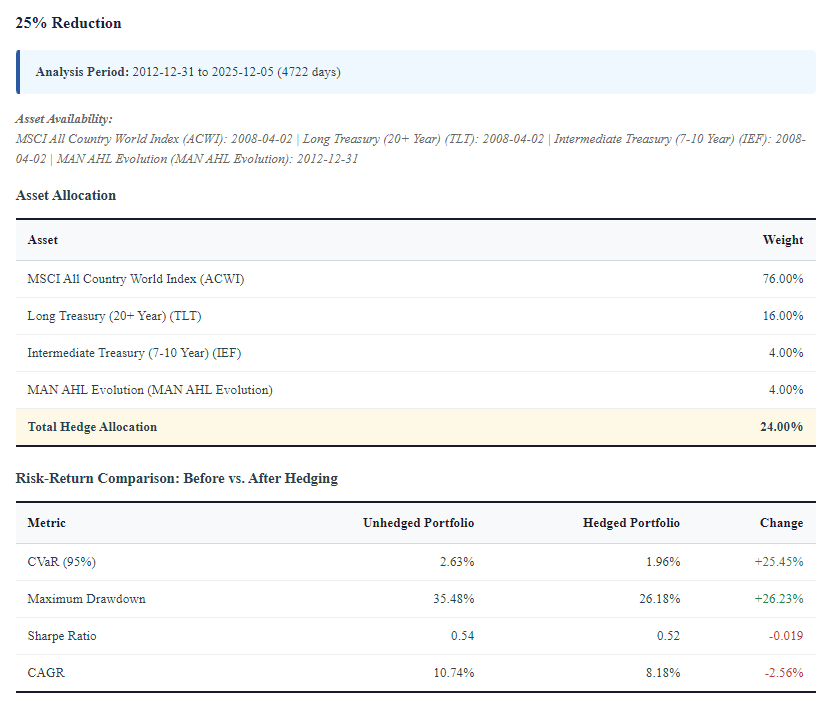

# Tail-Risk Hedge Lab

[](https://creativecommons.org/licenses/by-nc/4.0/)
[](https://www.python.org/downloads/)

**Find the best way to protect your portfolio during market crashes.**

Tail-Risk Hedge Lab answers: *"Which assets truly protect when stocks crash, and how much should you hold?"*

---

## What It Does

- **Downloads market data** automatically (via Yahoo Finance or custom Excel files)
- **Identifies crisis periods** using multiple detection methods
- **Tests hedge assets** (bonds, gold, Bitcoin, managed futures, etc.)
- **Finds optimal allocations** to reduce your portfolio risk by 10%, 25%, or 50%
- **Generates HTML report** with charts and statistics

---

## Quick Start

### 1. Install

```bash
git clone https://github.com/lbsm2017/Tail-Risk-Hedge-Lab.git
cd Tail-Risk-Hedge-Lab
pip install -r requirements.txt
```

### 2. Run

```bash
python main.py
# Or use the Makefile:
make run
```

**Makefile Commands:**
- `make run` — Run the complete analysis
- `make tests` — Run all tests to verify everything works
- `make clean` — Delete cached data and start fresh
- `make help` — Show available commands

### 3. View Results

Open the generated report in `output/tail_risk_analysis_YYYY.MM.DD.HH.MM.SS.html`

---

## Configuration

Edit `config.yaml` to customize your analysis:

```yaml
data:
  start_date: "2000-01-01"  # When to start analysis (ACWI inception)
  end_date: null            # null = latest available

assets:
  base: "ACWI"              # Your baseline portfolio
  hedges:
    - ticker: "TLT"         # Asset ticker
      name: "Long Treasury (20+ Year)"
      max_weight: 0.50      # Maximum allocation allowed
    - ticker: "IEF"
      name: "Intermediate Treasury (7-10 Year)"
      max_weight: 0.50
    - ticker: "SHY"
      name: "Short Treasury (1-3 Year)"
      max_weight: 0.50
    - ticker: "GLD"
      name: "Gold"
      max_weight: 0.40
    - ticker: "SLV"
      name: "Silver"
      max_weight: 0.25
    - ticker: "BTC-USD"
      name: "Bitcoin"
      max_weight: 0.15
    - ticker: "DBMF"
      name: "Managed Futures (Trend Following)"
      max_weight: 0.30
    # Add more assets...

optimization:
  targets: [0.10, 0.25, 0.50]  # Risk reduction targets (10%, 25%, 50%)
```

### Adding Custom Assets

Place Excel files in `data/import/` with two columns:

| Date       | Return% |
|------------|---------|
| 2020-01-01 | 0.5%     |
| 2020-01-02 | -0.3%    |
| 2020-01-03 | 1.2%     |

The file name becomes the asset name (e.g., `Hedgefund_XYZ.xlsx` → "MAN_AHL_Evolution").

---

## Sample Output

The report includes:

| Section | What You'll See |
|---------|-----------------|
| **Executive Summary** | Analysis period, crisis statistics, risk-free rate |
| **Individual Hedges** | How each asset performs during crises |
| **Optimal Portfolios** | Best allocations for 10%, 25%, 50% risk reduction |
| **Charts** | Rolling correlations with crisis periods highlighted |

**Key Metrics Explained:**
- **CVaR (Expected Shortfall)**: Average loss during the worst 5% of days
- **Maximum Drawdown**: Largest peak-to-trough decline
- **Sharpe Ratio**: Return per unit of risk (adjusted for US Treasury rates)



---

## Project Structure

```
Tail-Risk-Hedge-Lab/
├── main.py              # Run this
├── config.yaml          # Your settings
├── data/import/         # Put custom Excel files here
├── output/              # Reports saved here
└── docs/methodology.md  # Technical details
```

---

## Learn More

For methodology, math formulas, and academic references, see:
- **[Full Methodology](docs/methodology.md)** — Crisis detection, risk metrics, optimization algorithms
- **[Risk-Free Rate Integration](docs/risk_free_rate_integration.md)** — How Sharpe ratios are calculated
- **[Security Policy](SECURITY.md)** — Vulnerability reporting and security best practices

---

## License

**Non-Commercial Use**: [CC BY-NC 4.0](https://creativecommons.org/licenses/by-nc/4.0/) — Free for research and personal use.

**Commercial Use**: Contact lorenzo.bassetti@gmail.com

---

## Contact

**Lorenzo Bassetti** — lorenzo.bassetti@gmail.com — [@lbsm2017](https://github.com/lbsm2017)

---

## Disclaimer

This is for research and education only. Not investment advice. Past performance doesn't guarantee future results.

---

**⭐ Star this repo if you find it useful!**
